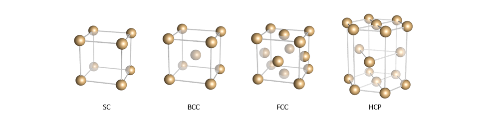
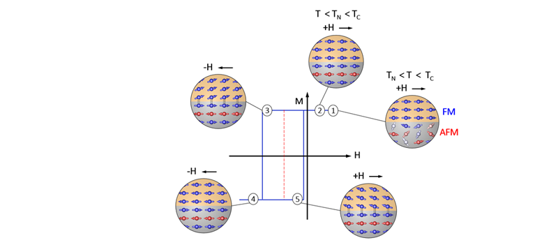

# magnetic-lab-msu
This branch of git has been made up to share the graphical templates for using on gnuplot.
More info: www.gnuplot.info/

Additionally, the fundamental tutorials of the visualization software (POV-Ray) 
for producing the high qualitative images with realistic reflection is also presented.
More info: www.povray.org

WHAT IS GNUPLOT?

WHAT IS POV-Ray?

