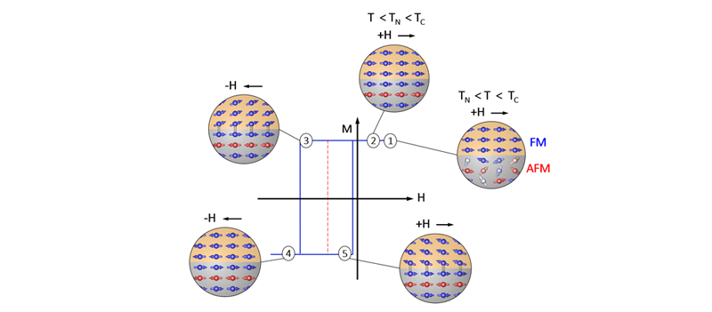

# magnetic-lab-msu
This branch of git has been made up to share our graphical templates for using on gnuplot (more info: www.gnuplot.info/).
Additionally, the fundamental tutorials of the POV-Ray visualization software package (more info: www.povray.org) for producing the high qualitative images with realistic reflection is also presented.

WHAT IS GNUPLOT?

WHAT IS POV-Ray?

        
      

The visualization is also very useful for the description of some complex phenomema in Physics. The following image refers to the....

